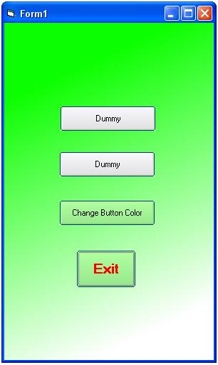

<div align="center">

## XP Style Button


</div>

### Description

This XP-Style Button can be placed on any structured background without distubance of the 'Skin'. The corners are slightly rounded. MouseOver and TabStop will be highlighted. The color of the button can be adapted to any color during runtime. No pictures are used.
 
### More Info
 


<span>             |<span>
---                |---
**Submitted On**   |2004-06-27 08:49:02
**By**             |[L\. Kobarg](https://github.com/Planet-Source-Code/PSCIndex/blob/master/ByAuthor/l-kobarg.md)
**Level**          |Advanced
**User Rating**    |4.0 (8 globes from 2 users)
**Compatibility**  |VB 6\.0
**Category**       |[Custom Controls/ Forms/  Menus](https://github.com/Planet-Source-Code/PSCIndex/blob/master/ByCategory/custom-controls-forms-menus__1-4.md)
**World**          |[Visual Basic](https://github.com/Planet-Source-Code/PSCIndex/blob/master/ByWorld/visual-basic.md)
**Archive File**   |[XP\_Style\_B1762706272004\.zip](https://github.com/Planet-Source-Code/l-kobarg-xp-style-button__1-54622/archive/master.zip)

### API Declarations

```
Private Declare Function CreateRectRgn Lib "gdi32" (ByVal X1 As Long, ByVal Y1 As Long, ByVal X2 As Long, ByVal Y2 As Long) As Long
Private Declare Function CombineRgn Lib "gdi32" (ByVal hDestRgn As Long, ByVal hSrcRgn1 As Long, ByVal hSrcRgn2 As Long, ByVal nCombineMode As Long) As Long
Private Declare Function GetPixel Lib "gdi32" (ByVal hdc As Long, ByVal x As Long, ByVal y As Long) As Long
Private Declare Function SetWindowRgn Lib "user32" (ByVal hwnd As Long, ByVal hRgn As Long, ByVal bRedraw As Long) As Long
'For drawing the caption
Private Declare Function SetTextColor Lib "gdi32" (ByVal hdc As Long, ByVal crColor As Long) As Long
Private Declare Function DrawText Lib "user32" Alias "DrawTextA" (ByVal hdc As Long, ByVal lpStr As String, ByVal nCount As Long, lpRect As RECT, ByVal wFormat As Long) As Long
'Rect drawing
Private Declare Function FillRect Lib "user32" (ByVal hdc As Long, lpRect As RECT, ByVal hBrush As Long) As Long
Private Declare Function FrameRect Lib "user32" (ByVal hdc As Long, lpRect As RECT, ByVal hBrush As Long) As Long
'Create/Delete brush
Private Declare Function CreateSolidBrush Lib "gdi32" (ByVal crColor As Long) As Long
Private Declare Function DeleteObject Lib "gdi32" (ByVal hObject As Long) As Long
'For drawing lines
Private Declare Function MoveToEx Lib "gdi32" (ByVal hdc As Long, ByVal x As Long, ByVal y As Long, lpPoint As POINTAPI) As Long
Private Declare Function LineTo Lib "gdi32" (ByVal hdc As Long, ByVal x As Long, ByVal y As Long) As Long
'Misc
Private Declare Function SetPixel Lib "gdi32" Alias "SetPixelV" (ByVal hdc As Long, ByVal x As Long, ByVal y As Long, ByVal crColor As Long) As Long
Private Declare Function GetSysColor Lib "user32" (ByVal nIndex As Long) As Long
Private Declare Function GetCursorPos Lib "user32" (lpPoint As POINTAPI) As Long
```


